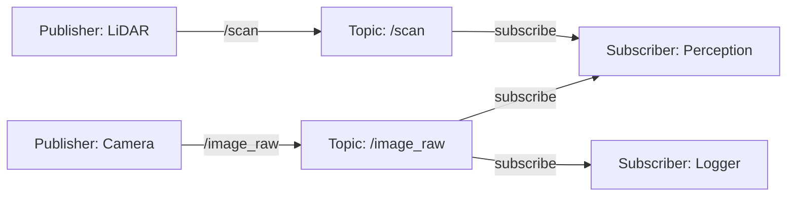

# Chapter 2: Publisher-Subscriber Pattern

## Learning Objectives

By the end of this chapter, you will be able to:

1. **Create** ROS 2 publisher nodes to broadcast sensor data
2. **Implement** subscriber nodes to process incoming messages
3. **Design** custom message types for robotics applications
4. **Analyze** topic communication using ROS 2 introspection tools

## Introduction

The publish-subscribe (pub/sub) pattern is the most common communication mechanism in ROS 2. It enables asynchronous, many-to-many data distribution where publishers send messages to named topics without knowing which subscribers (if any) will receive them[^1].

### When to Use Pub/Sub

✅ **Use topics for**:
- Continuous sensor data streams (camera images, LiDAR scans, IMU data)
- Robot state broadcasting (odometry, joint states)
- High-frequency data (>10 Hz)
- One-to-many or many-to-many communication

❌ **Avoid topics for**:
- Request-response interactions (use services instead)
- Long-running tasks with feedback (use actions instead)
- Guaranteed delivery requirements (topics are best-effort)

[^1]: ROS 2 Documentation. "Understanding Topics." https://docs.ros.org/en/humble/Tutorials/Beginner-CLI-Tools/Understanding-ROS2-Topics/Understanding-ROS2-Topics.html

## Topic Communication Architecture



### Quality of Service (QoS)

ROS 2 uses DDS QoS policies to configure communication reliability:

| Policy | Sensor Data | Critical Commands |
|--------|------------|-------------------|
| **Reliability** | Best Effort | Reliable |
| **Durability** | Volatile | Transient Local |
| **History** | Keep Last (1) | Keep Last (10) |
| **Liveliness** | Automatic | Automatic |

## Creating a Publisher

### Python Publisher Example

Create a temperature sensor publisher:

```python
import rclpy
from rclpy.node import Node
from std_msgs.msg import Float32

class TemperatureSensor(Node):
    def __init__(self):
        super().__init__('temperature_sensor')
        self.publisher = self.create_publisher(Float32, '/temperature', 10)
        self.timer = self.create_timer(1.0, self.publish_temperature)  # 1 Hz
        self.get_logger().info('Temperature sensor node started')

    def publish_temperature(self):
        msg = Float32()
        msg.data = 25.5  # Simulated temperature in Celsius
        self.publisher.publish(msg)
        self.get_logger().info(f'Publishing temperature: {msg.data}°C')

def main(args=None):
    rclpy.init(args=args)
    node = TemperatureSensor()
    rclpy.spin(node)
    node.destroy_node()
    rclpy.shutdown()

if __name__ == '__main__':
    main()
```

**Key components**:
- `create_publisher(msg_type, topic_name, qos_depth)`: Creates publisher
- `create_timer(period_sec, callback)`: Periodic message publishing
- `publish(msg)`: Sends message to topic

## Creating a Subscriber

### Python Subscriber Example

Create a subscriber to log temperature data:

```python
import rclpy
from rclpy.node import Node
from std_msgs.msg import Float32

class TemperatureLogger(Node):
    def __init__(self):
        super().__init__('temperature_logger')
        self.subscription = self.create_subscription(
            Float32,
            '/temperature',
            self.temperature_callback,
            10
        )
        self.get_logger().info('Temperature logger node started')

    def temperature_callback(self, msg):
        self.get_logger().info(f'Received temperature: {msg.data}°C')

        # Alert if temperature exceeds threshold
        if msg.data > 30.0:
            self.get_logger().warn(f'High temperature alert: {msg.data}°C')

def main(args=None):
    rclpy.init(args=args)
    node = TemperatureLogger()
    rclpy.spin(node)
    node.destroy_node()
    rclpy.shutdown()

if __name__ == '__main__':
    main()
```

**Key components**:
- `create_subscription(msg_type, topic_name, callback, qos_depth)`: Creates subscriber
- `callback(msg)`: Function called when message received

## Running Publisher-Subscriber

```bash
# Terminal 1: Start publisher
ros2 run my_package temperature_sensor

# Terminal 2: Start subscriber
ros2 run my_package temperature_logger
```

## Introspection Tools

### Inspecting Topics

```bash
# List all active topics
ros2 topic list

# Show topic details
ros2 topic info /temperature

# Echo messages in real-time
ros2 topic echo /temperature

# Measure message rate
ros2 topic hz /temperature
```

### Visualizing Topic Graph

```bash
# Install rqt_graph
sudo apt install ros-humble-rqt-graph

# Visualize node and topic connections
rqt_graph
```

## Custom Message Types

For complex data structures, define custom messages:

**File**: `my_msgs/msg/SensorReading.msg`
```
# Custom sensor message
string sensor_id
float64 value
float64 uncertainty
time stamp
```

**Usage**:
```python
from my_msgs.msg import SensorReading

msg = SensorReading()
msg.sensor_id = 'IMU_01'
msg.value = 9.81
msg.uncertainty = 0.05
msg.stamp = self.get_clock().now().to_msg()
```

## Exercise

**Task**: Create a pair of nodes where a "robot battery" publisher sends battery percentage (0-100%) every 2 seconds, and a "battery monitor" subscriber logs warnings when battery drops below 20%.

**Expected behavior**:
1. Publisher sends battery level: 100%, 95%, 90%, ..., 15%, 10%
2. Subscriber logs all values
3. Subscriber warns when level < 20%

**Code Example**: See `examples/module-01-ros2-fundamentals/example-01-pubsub/`

## Summary

In this chapter, you learned:
- The publish-subscribe communication pattern
- How to create publishers and subscribers in Python
- Topic introspection with ROS 2 CLI tools
- When to use topics vs. services/actions

**Next**: [Chapter 3: Creating ROS 2 Packages](./chapter-03-packages.md) - Learn how to organize your code into maintainable ROS 2 packages.

## Further Reading

- [ROS 2 Python Client Library (rclpy)](https://docs.ros.org/en/humble/p/rclpy/)
- [ROS 2 QoS Policies](https://docs.ros.org/en/humble/Concepts/About-Quality-of-Service-Settings.html)
- [DDS-based Communication](https://design.ros2.org/articles/ros_on_dds.html)

---

**Estimated Reading Time**: 25 minutes
**Hands-On Time**: 45 minutes
